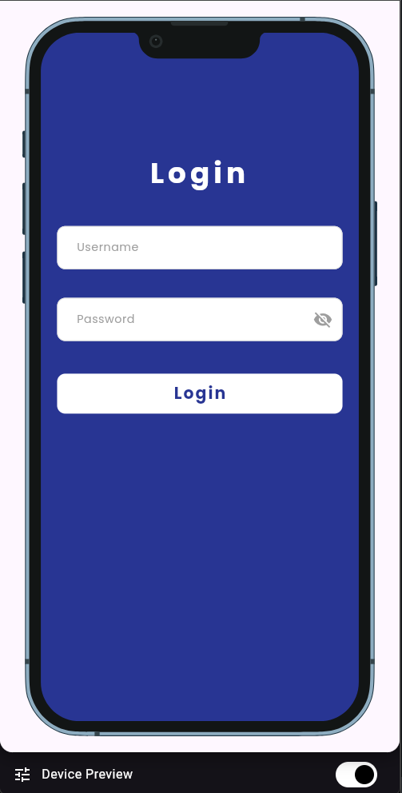
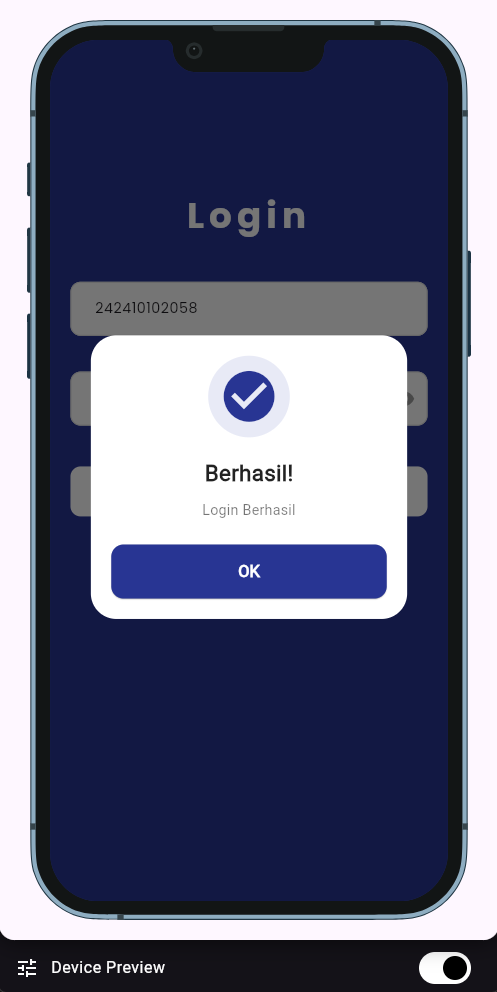
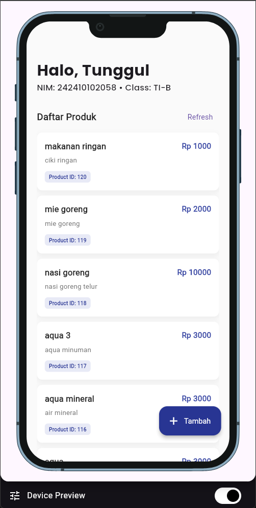
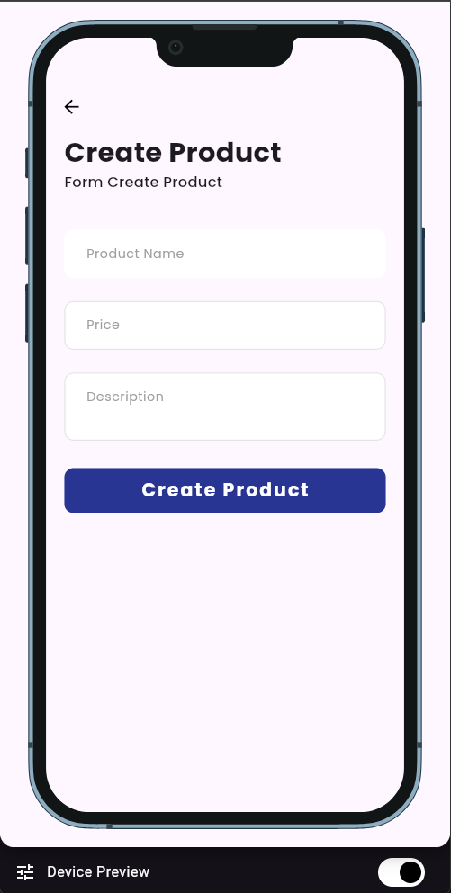
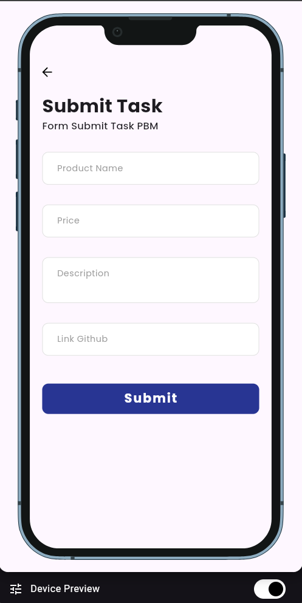
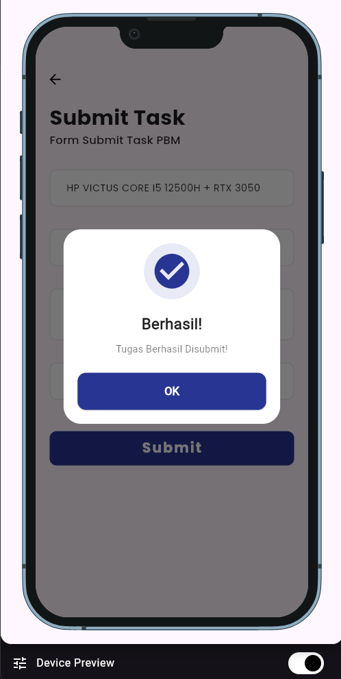

# 📱 Tugas Praktikum PBM - Flutter Application


<p align="center">
  
  
  
  
  
  
  
  
</p>

## 📂 Struktur Folder (Project Directory Tree)

```text
lib/
├── config/              # Konfigurasi Pusat
│   └── api_config.dart  # Endpoint & Base URL API
├── DTO/                 # Data Transfer Objects (Request)
│   ├── login_request.dart
│   ├── create_product_request.dart
│   └── submit_request.dart
├── models/              # Data Models (Response)
│   ├── user_model.dart
│   ├── product_model.dart
│   ├── class_model.dart
│   └── role_model.dart
├── providers/           # State Management (Logic)
│   ├── auth_provider.dart
│   ├── products_provider.dart
│   └── submit_provider.dart
├── screens/             # UI Halaman (Views)
│   ├── login_screen.dart
│   ├── dashboard_screen.dart
│   ├── create_product_screen.dart
│   └── submit_screen.dart
├── services/            # API Integration (HTTP)
│   ├── auth_service.dart
│   ├── product_service.dart
│   └── submit_service.dart
├── utils/               # Helpers & Routing
│   └── app_routes.dart  # Sentralisasi Navigasi
└── widgets/             # Reusable UI Components
    ├── w_button.dart    # Komponen Tombol
    ├── w_card.dart      # Komponen Kartu Produk
    ├── w_header.dart    # Komponen Header Halaman
    ├── w_text_form_field.dart
    ├── w_success_dialog.dart
    └── w_failed_dialog.dart

